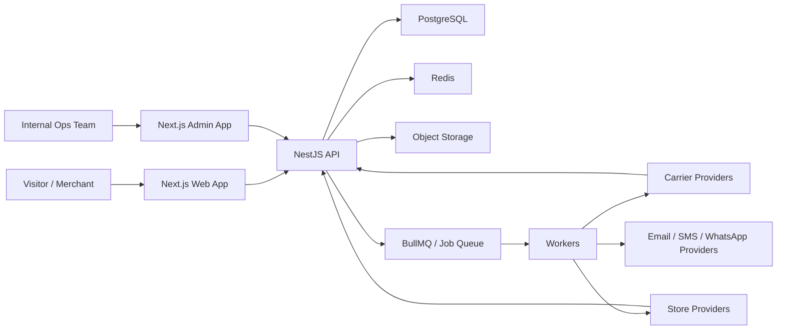

# System Architecture

## 1. Product Direction

MASARX ليس موقعًا تعريفيًا فقط، بل منصة تشغيل لوجستية كاملة تخدم ثلاث طبقات مترابطة:

1. الزائر قبل التسجيل: يتعرف على القيمة، يحسب السعر، يطلب عرضًا أو يسجل مباشرة.
2. العميل بعد التسجيل: يدير الطلبات والشحنات والتكاملات والتتبع والتقارير من لوحة موحدة.
3. فريق التشغيل الداخلي: يدير الحسابات، المزودين، جداول الأسعار، المحتوى، والمراقبة التشغيلية.

الهدف من المعمارية هو الحفاظ على تجربة موحدة في الواجهة، مع فصل واضح في المسؤوليات داخل النظام.

## 2. Architectural Choice

الخيار المقترح للمرحلة الأولى:

- `Modular Monolith` للـ API
- `Background Workers` للعمليات الثقيلة وغير المتزامنة
- `Provider/Adapter Layer` للتكاملات
- `Shared Design System` بين الموقع العام واللوحات
- `Tenant-aware data model` منذ اليوم الأول

هذا الخيار أفضل من Microservices في البداية لأنه:

- أسرع في التنفيذ وضبط الجودة
- أسهل في الاختبار والـ debugging
- يقلل التعقيد التشغيلي المبكر
- يسمح لاحقًا باستخراج بعض الموديولات إلى خدمات مستقلة عند الحاجة

## 3. Suggested Monorepo Layout

```text
apps/
  web/            -> marketing site + auth + customer dashboard
  admin/          -> internal admin console
  api/            -> NestJS API (REST v1)
  worker/         -> BullMQ workers / schedulers / webhook processors
packages/
  ui/             -> shared design system, tokens, data-table primitives
  config/         -> eslint, tsconfig, env validation, shared constants
  database/       -> Prisma schema, migrations, seeders
  contracts/      -> DTOs, Zod schemas, API types
  integrations/   -> provider interfaces + provider implementations
  utils/          -> shared helpers
  analytics/      -> metrics, report query helpers
```

## 4. High-Level Architecture



## 5. Frontend Surfaces

### `apps/web`

واجهة واحدة بهوية موحدة، لكنها مقسمة وظيفيًا عبر route groups:

- `/(marketing)` للموقع العام
- `/(auth)` للتسجيل والدخول والتحقق
- `/(onboarding)` للتهيئة الأولية
- `/(app)` للوحة العميل
- `/track` للتتبع العام
- `/pricing-calculator` للحاسبة العامة

### `apps/admin`

تطبيق داخلي منفصل للأدمن والتشغيل، لأن احتياجاته وصلاحياته مختلفة:

- إدارة الحسابات والاشتراكات
- إدارة المزودين وجداول الأسعار
- مراجعة السجلات والأخطاء والتذاكر
- إدارة محتوى الموقع العام

## 6. Backend Module Map

الموديولات الأساسية المقترحة داخل `apps/api`:

- `auth`: التسجيل، التحقق، الجلسات، refresh tokens، MFA لاحقًا
- `accounts`: الشركات، الاشتراكات، حالة الحساب، الإعدادات العامة
- `users`: المستخدمون، الدعوات، ربط المستخدمين بالحسابات
- `rbac`: الأدوار، الصلاحيات، scope حسب الحساب/الفرع
- `onboarding`: خطوات التهيئة والتخطي والاستكمال لاحقًا
- `orders`: الطلبات، العناصر، الاستيراد والتصدير، bulk actions
- `customers`: بيانات المستلمين، العناوين المتكررة، منع التكرار
- `shipments`: إنشاء الشحنات، البوليصات، الإلغاء، إعادة الإنشاء
- `tracking`: سجل الحالات، mapping, public tracking endpoint
- `returns`: طلبات المرتجع، الأسباب، الموافقات، الشحنات العكسية
- `branches`: الفروع، المستودعات، العناوين، الافتراضيات
- `integrations`: الاتصالات مع المتاجر، شركات الشحن، الرسائل
- `pricing`: الحاسبة، جداول الأسعار، quote engine, surcharge rules
- `notifications`: in-app, email, SMS, templates, preferences
- `reports`: KPIs، التجميعات، التصدير، الرسوم
- `billing`: الاشتراكات، الفواتير، wallet, usage fees
- `webhooks`: استقبال webhooks, verification, idempotency, queueing
- `audit`: audit log, activity feed, before/after snapshots
- `files`: رفع الصور والمرفقات والملفات المصدرة
- `settings`: policies, templates, status catalogs, feature flags
- `admin`: internal-only endpoints and operations

## 7. API Design

المسار المقترح:

- REST-first API تحت `/api/v1`
- OpenAPI/Swagger للتوثيق الداخلي
- Webhooks outbound للمستقبل
- GraphQL ليس ضروريًا في MVP

قواعد التصميم:

- أسماء موارد واضحة: `/orders`, `/shipments`, `/integrations`
- Pagination موحد: `page`, `pageSize`
- Filtering موحد عبر query params
- Sorting موحد: `sortBy`, `sortDir`
- Bulk endpoints صريحة: `/orders/bulk-create-shipments`
- Idempotency keys للعمليات الحساسة
- Error envelope موحد يحتوي على `code`, `message`, `details`, `requestId`

## 8. Recommended Stack

### Frontend

- `Next.js` App Router
- `TypeScript`
- `Tailwind CSS` مع design tokens واضحة
- `TanStack Query` للـ server state
- `TanStack Table` للجداول الاحترافية
- `React Hook Form + Zod` للنماذج والتحقق
- `next-intl` لدعم العربية والإنجليزية
- `Chart.js` أو `Recharts` للرسوم في البداية

### Backend

- `NestJS`
- `TypeScript`
- `Prisma + PostgreSQL`
- `BullMQ + Redis`
- `Zod` أو `class-validator` للـ DTO validation
- `OpenTelemetry` hooks من البداية

### Infra

- `PostgreSQL`
- `Redis`
- `S3-compatible object storage`
- `GitHub Actions`
- `Sentry`

## 9. Why This Stack?

- TypeScript across the stack يقلل friction بين الواجهة والباك إند
- Next.js مناسب للموقع التسويقي + dashboard + SEO + i18n
- NestJS ممتاز للـ modular architecture والـ decorators والـ DI
- PostgreSQL قوي جدًا للعلاقات المعقدة، الفلاتر، التقارير، والاعتمادية
- Prisma يسرع الانطلاق مع typing جيد ومهاجرات واضحة
- Redis/BullMQ أساسيان للـ retries, sync jobs, webhook processing

## 10. Scale Path

المسار المقترح للتوسع دون إعادة بناء:

1. نبدأ بـ modular monolith واحد للـ API.
2. نفصل `worker` كخدمة مستقلة من البداية.
3. عند ارتفاع الحمل يمكن استخراج:
   - `tracking`
   - `integrations`
   - `notifications`
   - `reports`
4. نضيف read replicas وcaching للقراءات الثقيلة.
5. لاحقًا يمكن بناء `public API` و`mobile BFF` فوق نفس النواة.
