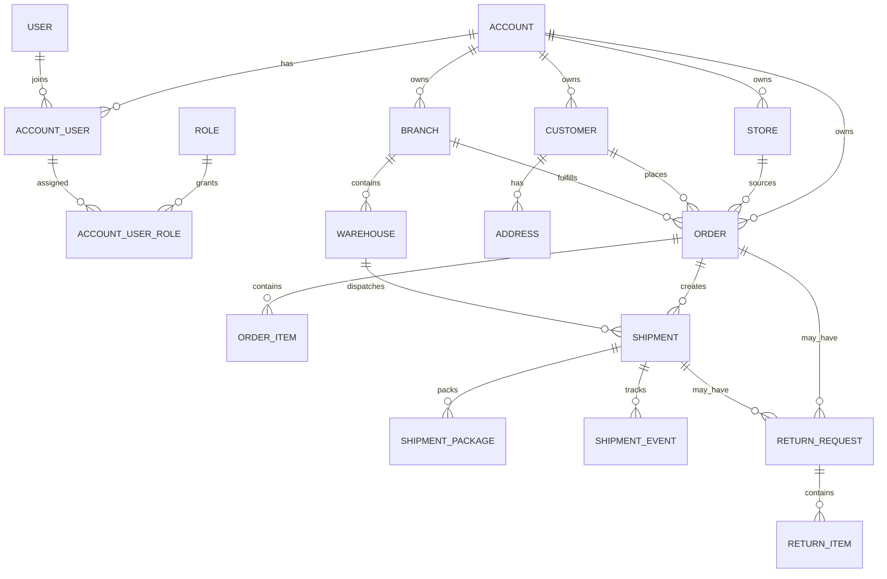
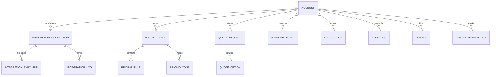

# Data Model & ERD

## 1. Modeling Principles

- كل البيانات التشغيلية يجب أن تكون `tenant-scoped` عبر `account_id`
- كل تكامل خارجي يجب أن يحتفظ بـ `external_id` و `provider`
- السجلات الزمنية المهمة يجب أن تكون immutable أو append-only قدر الإمكان
- لا نعتمد على status text حرّ؛ بل catalogs قابلة للإدارة داخليًا
- الجداول التشغيلية الأساسية يجب أن تكون مهيأة للـ indexing من البداية

## 2. Entity Groups

### Identity & Organization

- `accounts`
- `users`
- `account_users`
- `roles`
- `permissions`
- `account_user_roles`
- `settings`

### Commercial & Operations

- `stores`
- `branches`
- `warehouses`
- `customers`
- `addresses`
- `orders`
- `order_items`
- `shipments`
- `shipment_packages`
- `shipment_events`
- `returns`
- `return_items`

### Integrations & Pricing

- `integration_connections`
- `integration_sync_runs`
- `integration_logs`
- `carrier_services`
- `pricing_tables`
- `pricing_rules`
- `pricing_zones`
- `quote_requests`
- `quote_options`
- `webhook_events`

### Platform & Finance

- `notifications`
- `notification_templates`
- `audit_logs`
- `invoices`
- `wallet_transactions`
- `attachments`

## 3. Core Operational ERD

## 4. Platform ERD

## 5. Recommended Key Columns

### `accounts`

- `id`
- `name`
- `slug`
- `status`
- `default_locale`
- `default_currency`
- `country_code`
- `created_at`

### `users`

- `id`
- `full_name`
- `email`
- `phone`
- `password_hash`
- `email_verified_at`
- `phone_verified_at`
- `last_login_at`

### `account_users`

- `id`
- `account_id`
- `user_id`
- `status`
- `is_owner`
- `default_branch_id`

### `stores`

- `id`
- `account_id`
- `name`
- `platform`
- `external_store_id`
- `status`
- `last_synced_at`

### `orders`

- `id`
- `account_id`
- `store_id`
- `customer_id`
- `branch_id`
- `order_number`
- `external_order_id`
- `status`
- `payment_status`
- `fulfillment_status`
- `currency`
- `subtotal_amount`
- `shipping_amount`
- `cod_amount`
- `total_amount`
- `notes`
- `placed_at`

### `shipments`

- `id`
- `account_id`
- `order_id`
- `carrier_connection_id`
- `carrier_service_code`
- `tracking_number`
- `reference_number`
- `status`
- `eta_date`
- `shipping_cost`
- `cod_fee`
- `label_url`
- `manifest_url`
- `created_at`

### `shipment_events`

- `id`
- `shipment_id`
- `provider`
- `provider_event_id`
- `raw_status`
- `normalized_status`
- `description`
- `event_time`
- `raw_payload`

### `integration_connections`

- `id`
- `account_id`
- `type`
- `provider`
- `display_name`
- `status`
- `encrypted_credentials`
- `settings_json`
- `last_sync_at`
- `last_error_at`

### `pricing_tables`

- `id`
- `account_id`
- `provider`
- `service_code`
- `scope`
- `currency`
- `effective_from`
- `effective_to`
- `is_active`

### `pricing_rules`

- `id`
- `pricing_table_id`
- `rule_type`
- `origin_zone`
- `destination_zone`
- `weight_from`
- `weight_to`
- `volumetric_divisor`
- `base_amount`
- `cod_amount`
- `remote_area_amount`
- `fuel_surcharge_percent`
- `rounding_strategy`

## 6. Indexing Priorities

من أول إصدار يجب إضافة فهارس على:

- `orders(account_id, status, placed_at desc)`
- `orders(account_id, order_number)`
- `shipments(account_id, status, created_at desc)`
- `shipments(account_id, tracking_number)`
- `shipment_events(shipment_id, event_time desc)`
- `integration_connections(account_id, type, provider)`
- `quote_requests(account_id, created_at desc)`
- `audit_logs(account_id, entity_type, entity_id, created_at desc)`

## 7. Data Notes

- `addresses` يفضل أن تكون polymorphic أو عبر جداول ربط واضحة
- `settings` تدار كمفاتيح منظمة حسب scope: account, branch, provider
- `audit_logs` يجب أن تخزن `actor`, `entity`, `before`, `after`, `ip`, `user_agent`
- `webhook_events` يجب أن تحتفظ بالـ payload الخام وحالة المعالجة والمحاولات
