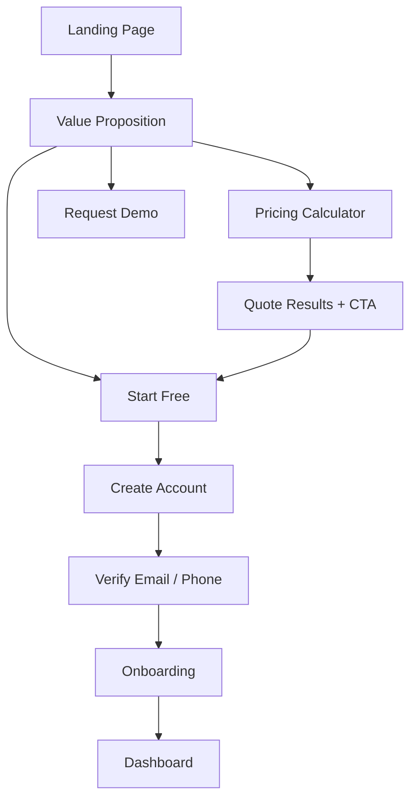
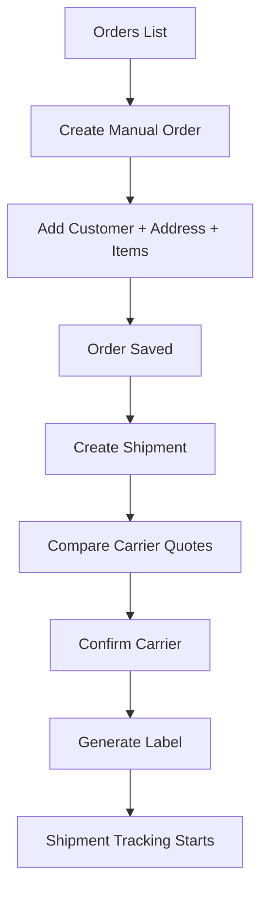

# User Flows

## 1. Visitor to Signup

الهدف: تحويل الزائر إلى تجربة قيمة مباشرة ثم تسجيل سهل.

### تفاصيل التدفق

1. الزائر يصل إلى الصفحة الرئيسية ويرى الرسالة الأساسية خلال أقل من 5 ثوان.
2. يمكنه الذهاب إلى الحاسبة مباشرة أو التسجيل أو طلب عرض.
3. نتائج الحاسبة تعرض سعرًا تقريبيًا ومدة متوقعة وخيارات مقارنة.
4. بعد التسجيل نطلب أقل بيانات ممكنة.
5. التهيئة تكمل تدريجيًا مع إمكانية التخطي.

## 2. Signup & Onboarding

### نموذج التسجيل الأولي

- الاسم
- البريد أو رقم الجوال
- كلمة المرور
- اسم الشركة أو المتجر

### خطوات Onboarding

1. إنشاء الحساب
2. التحقق من البريد أو الجوال
3. اختيار نوع النشاط
4. إدخال بيانات الشركة الأساسية
5. إضافة عنوان الشحن الأساسي
6. ربط متجر أو اختيار الإدخال اليدوي
7. ربط شركة شحن أو تفعيل مزود افتراضي
8. الوصول إلى الـ dashboard

### قواعد UX

- كل خطوة قابلة للتخطي إذا لم تكن blocking
- progress bar واضح
- حفظ تلقائي للحالة
- تذكيرات داخل النظام لإكمال التهيئة لاحقًا

## 3. Manual Order to Shipment

### نقاط مهمة

- إنشاء الشحنة من الطلب يجب أن يتم بنقرة واحدة
- المقارنة بين شركات الشحن جزء من التدفق نفسه
- الجداول تدعم البحث، الفلاتر، الإجراءات الجماعية، والطباعة

## 4. Store Integration Sync Flow

1. العميل يفتح صفحة التكاملات
2. يختار مزود المتجر
3. يدخل credentials أو OAuth
4. يحفظ الاتصال
5. تنشأ مهمة `initial sync`
6. تظهر حالة التقدم والأخطاء وآخر مزامنة
7. الطلبات الجديدة تظهر في قسم الطلبات مع `source=integration`

### قواعد تشغيلية

- لا تتم معالجة sync داخل request مباشر
- كل مزامنة تسجل في `integration_sync_runs`
- كل خطأ يحتفظ به مع سبب واضح وإمكانية إعادة المحاولة

## 5. Public Tracking Flow

1. العميل النهائي يفتح صفحة التتبع العامة
2. يدخل رقم التتبع أو رقم الطلب
3. النظام يجلب الشحنة المرتبطة
4. تعرض الحالة الحالية
5. يعرض timeline كامل للحالات السابقة
6. يظهر ETA وشركة الشحن عند توفرهما

## 6. Returns Flow

1. العميل أو موظف خدمة العملاء ينشئ طلب مرتجع
2. يحدد السبب ويرفع صورًا إذا لزم
3. يمر الطلب على policy engine
4. يقبل أو يرفض أو يراجع يدويًا
5. إذا لزم، يتم إنشاء شحنة عكسية
6. تتغير حالة الطلب والشحنة والتقارير accordingly

## 7. Admin Operations Flow

1. الأدمن يضيف شركة شحن أو متجرًا مدعومًا
2. يرفع جداول الأسعار أو يضبط rules
3. يراجع logs والـ webhooks وحالات الفشل
4. يدير المحتوى التسويقي وFAQ والطلبات الواردة
5. يراقب الحسابات والاشتراكات والتنبيهات الحرجة
